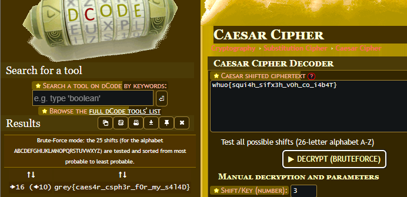

# GreyCTF'23

Background:

Grey Cat The Flag CTF, or GreyCTF is hosted by [NUS Greyhats](https://nusgreyhats.org/) in collaboration with [National Cybersecurity R\&D Labs](https://ncl.sg/). I joined this CTF as a [team](https://ctfd.nusgreyhats.org/teams/621) with my friends, Domi and Bowen. Altogether, we solved 6 challenges, placing us 57th place in the Singapore category and 147th place in the open category out of 454 teams.

## Crypto

### 1. Baby Crypto

```
whuo{squi4h_sifx3h_v0h_co_i4b4T}
```

<figure><figcaption></figcaption></figure>

Pretty simple challenge, it is a cipher. Caesar cipher, to be exact. So I just used dcode.fr for this.

<figure><figcaption></figcaption></figure>

The flag was found! "**grey{caes4r\_csph3r\_f0r\_my\_s4l4D}**"

## Misc

### 1. CrashPython

<figure><figcaption></figcaption></figure>

I didn't get the screenshot of the full page unfortunately, but the gist of it was that there was a placeholder to input python code to run to cause a crash (through segmentation fault), but the code had to fulfil the requirements of the blacklist. The blacklist included keywords that couldn't be used in the code.


Initially, I tested with a stack overflow error with infinite recursion as such:

```python
def recursion():
    recursion()

recursion()
```

But it didn't work. My teammate then told me (Eureka moment...) that it didn't meet the requirements of a segmentation fault. I then looked around for solutions to cause a segmentation fault.&#x20;

I ended up with this simple code:

<pre class="language-python"><code class="lang-python"><strong>import ctypes
</strong>def segfault():
    # Access an invalid memory location
    ctypes.string_at(0)

segfault()
</code></pre>

And that worked!&#x20;

<figure><figcaption></figcaption></figure>
