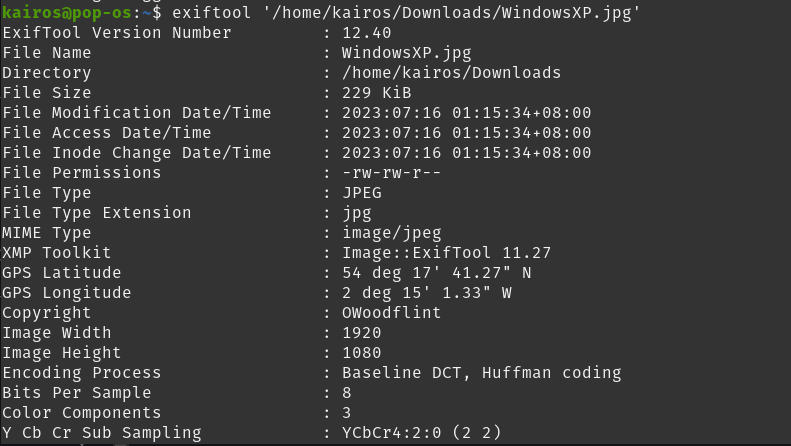
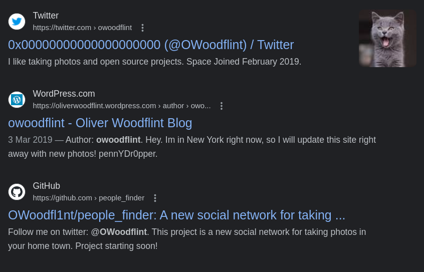
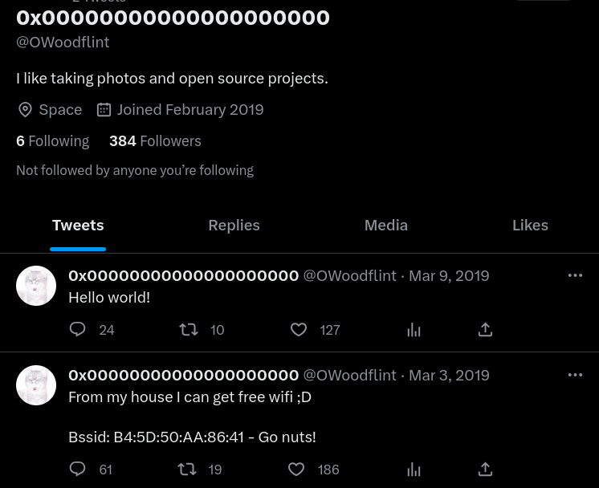
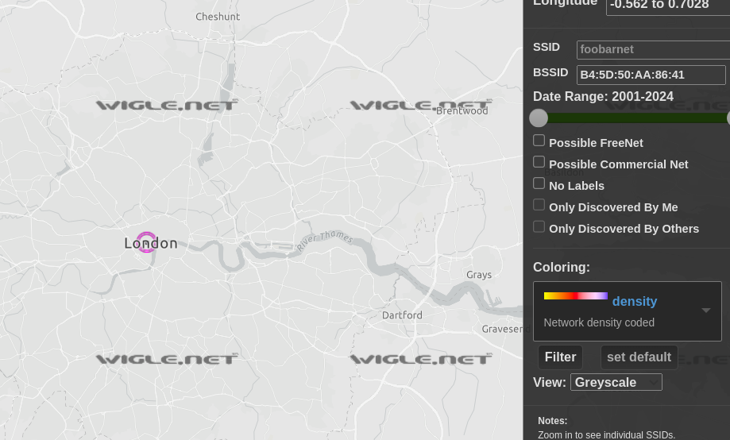
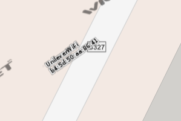
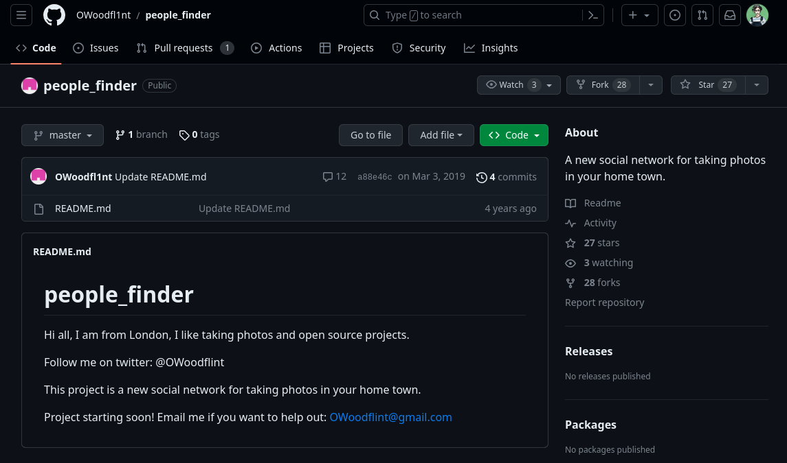
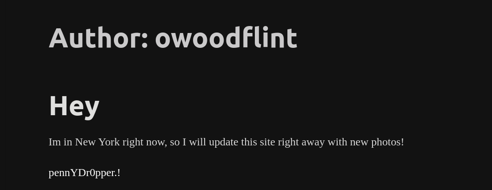

# OhSINT

### Tasks

Image we got:&#x20;

<figure><figcaption></figcaption></figure>

1. **What is this user's avatar of?**

First, I tried to use exiftool to see what properties this image has.

<figure><figcaption></figcaption></figure>

This image seems to be attributed to someone named "OWoodflint", and I had it just sent to Google to check them out.&#x20;

<figure><figcaption></figcaption></figure>

And from the results, I can get their Twitter, GitHub and blog.

So to answer the first question, the user's avatar is of a cat! :D&#x20;

***

2. **What city is this person in?**

I went to dig around their Twitter:

<figure><figcaption></figcaption></figure>

From here, I can get the BSSID for a wifi point near their house.&#x20;

Entering it into Wigle.net, I could get the city they were in.

<figure><figcaption></figcaption></figure>

City: London

***

3. **What is the SSID of the WAP he connected to?**

Still on Wigle.net, zooming in into the WAP could give the SSID.

<figure><figcaption></figcaption></figure>

**SSID: UnileverWIFI**

***

4. **What is his personal email address?**

I looked around on his blog but didn't manage to get his email unfortunately, so I went on to the third link, which was his GitHub account.

<figure><figcaption></figcaption></figure>

Which on his README.md page, contains his email!

**Email:** OWoodflint@gmail.com

***

5. **What site did you find his email address on?**

Just GitHub :)

***

6. **Where has he gone on holiday?**

I went back to his blog and found that he was in New York, which was where he had gone on his holiday.&#x20;

<figure><figcaption></figcaption></figure>

***

7. **What is the person's password?**

I was a little confused about this question because the hint was checking the source... BUT!

I have a dark reader chrome extension enabled which made me see the password immediately :") when it is supposed to blend into the white background. Oh well! :D&#x20;

<figure><figcaption></figcaption></figure>

***

